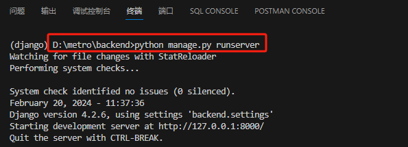

### 1. 创建一个虚拟环境后安装依赖

```bash
pip install -r requirements.txt
```

### 2. 对数据库产生迁移文件（这里我设置的是sqlite3，后续部署会换成mysql）
```bash
python manage.py makemigrations
```

### 3. 对数据库进行迁移并创建本地数据库 db.sqlite3
```bash
python manage.py migrate
```

### 4. 创建超级管理员
```bash
python manage.py createsuperuser
```

用户名 `username` 为：admin

邮箱随便填写：admin@gmail.com

密码 `password` 必须为：111111

忽略密码过于简单的报错 y

### 5. 启动后端服务器
```bash
python manage.py runserver
```

### 其中启动的端口为  `http://127.0.0.1:8000/`

